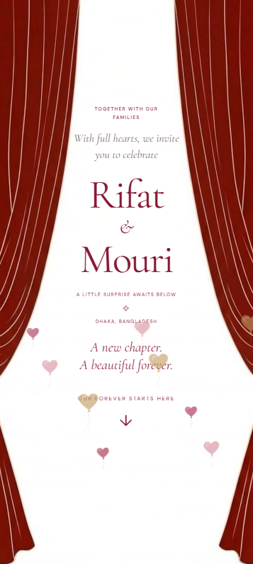

# Interactive Wedding Invitation

An elegant, responsive wedding invitation built with **React** and **Vite**. It turns a traditional invitation into an interactive experience with a curtain reveal, live countdown, scratch-card interaction, venue information, calendar download, and RSVP interface.

> This is an independent implementation inspired by a publicly visible wedding-invitation concept. It is not affiliated with the original commercial product.

## Live Demo

[View the live website](https://framer-wedding-website.vercel.app/) · [Browse the source code](https://github.com/hriidzhridoy/wedding-website)

## Preview



## Features

- Animated curtain opening
- Personalized couple and wedding details
- Live countdown to the wedding
- Scratch-card interaction
- Scroll-reveal animations
- Venue details and map link
- Downloadable calendar event
- Dress-code and gift-information sections
- Responsive design for mobile, tablet, and desktop
- Reduced-motion support for accessibility
- RSVP interface ready to connect to a backend or form service
- Playwright end-to-end test setup

## Built With

- React
- Vite
- JavaScript
- CSS
- Playwright

## Project Structure

```text
wedding-website/
├── public/                     # Static assets
├── src/
│   ├── components/
│   │   ├── effects/            # Visual effects and animation components
│   │   ├── invitation/         # Wedding invitation sections
│   │   ├── rsvp/               # RSVP interface components
│   │   └── scratch/            # Scratch-card components
│   ├── data/
│   │   └── wedding.js          # Couple, date, venue, and invitation content
│   ├── hooks/
│   │   ├── useReducedMotion.js
│   │   ├── useScratchSurface.js
│   │   └── useScrollReveal.js
│   ├── lib/
│   │   ├── calendar.js         # Calendar event generation
│   │   ├── scratchCanvas.js    # Scratch-card canvas logic
│   │   └── weddingDate.js      # Wedding date and countdown utilities
│   ├── styles/                 # Application styles
│   ├── App.jsx
│   └── main.jsx
├── tests/                      # End-to-end tests
├── index.html
├── package.json
├── playwright.config.js
└── vite.config.js
```

## Getting Started

### Requirements

- Node.js 18 or newer
- npm

### Installation

Clone the repository:

```bash
git clone https://github.com/hriidzhridoy/wedding-website.git
cd wedding-website
```

Install the dependencies:

```bash
npm install
```

Start the development server:

```bash
npm run dev
```

Vite will print a local address, usually:

```text
http://localhost:5173
```

To open the site on another device connected to the same Wi-Fi network, run:

```bash
npm run dev -- --host
```

## Customization

Most wedding information is kept in one place:

```text
src/data/wedding.js
```

Update that file to change details such as:

- Bride and groom names
- Wedding date and time
- Venue name and address
- Google Maps link
- Invitation message
- Dress code
- Gift message
- RSVP deadline

Place images, icons, music, and other static files inside `public/`. Update the styles inside `src/styles/` to change the colors, typography, spacing, or animations.

## Available Commands

```bash
npm run dev       # Start the local development server
npm run build     # Create a production build
npm run preview   # Preview the production build locally
```

Run the Playwright tests with:

```bash
npx playwright test
```

If Playwright browsers are not installed yet, run:

```bash
npx playwright install
```

## Production Build

Create an optimized production build:

```bash
npm run build
```

The generated website will be placed in the `dist/` directory. Test it locally with:

```bash
npm run preview
```

## Deployment

This Vite project can be deployed to platforms such as Vercel, Netlify, GitHub Pages, or any server that can host static files.

For Vercel or Netlify, use:

```text
Build command: npm run build
Output directory: dist
```

## RSVP Status

The current RSVP section is a front-end interface. Connect it to a backend, database, email service, Google Form, Formspree, or another form provider before collecting real guest responses.

Never commit API keys, passwords, guest lists, or private wedding information to a public repository. Put secrets in an `.env` file and keep that file in `.gitignore`.

## Background

This project began when a friend shared a wedding-website Reel and asked whether a similar experience could be created for his upcoming wedding. The original product was closed source, so the visible experience was studied and rebuilt as an independent React application with reusable components, centralized wedding data, custom hooks, and responsive interactions.

## Future Improvements

- Store RSVP responses in a database
- Send confirmation emails
- Add a wedding photo gallery
- Add optional background music controls
- Support multiple languages
- Create an admin page for updating wedding details
- Generate a unique invitation link for each guest

## License

Add a license before allowing other people to reuse the project. The [MIT License](https://opensource.org/license/mit) is a common choice for an open-source portfolio project.

## Author

Created by **[@hriidzhridoy](https://github.com/hriidzhridoy)**.

- Repository: [github.com/hriidzhridoy/wedding-website](https://github.com/hriidzhridoy/wedding-website)

If you found this project useful, consider giving the repository a star.
